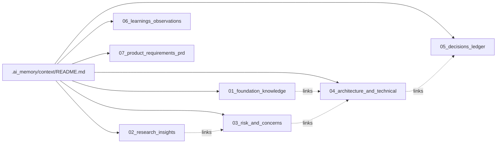

# Neural Memory Layer for TOTAL CARE / TOTAL CARE Dubai

## 1. Purpose

This is the canonical memory path (`.ai_memory/context/`) acting as the Single Source of Truth (SSOT) for all AI agents working on this workspace.

## 2. Neuron Registry Table

| ID    | Title                         | Importance | Status    | Summary                                               |
| ----- | ----------------------------- | ---------- | --------- | ----------------------------------------------------- |
| K-001 | Core Project Identity         | 10         | confirmed | Luxury B2B/B2C renovation and labour supply.          |
| K-002 | Renovation Context            | 9          | confirmed | Market scale and environment targets.                 |
| R-001 | Enterprise Psychology         | 7          | confirmed | High-end clients demand speed and direct VIP contact. |
| R-002 | Competitive Landscape         | 6          | confirmed | Luxury styling vs basic generic labour supply.        |
| X-001 | Deployment & Security Risks   | 9          | confirmed | Vercel CLI deployments required; Lovable sync risks.  |
| X-002 | Regulatory Compliance Risks   | 7          | confirmed | UAE labor and construction certification standards.   |
| T-001 | System Architecture           | 10         | confirmed | TanStack Start, Tailwind, GSAP, Supabase.             |
| T-002 | TanStack Router Matrix        | 8          | confirmed | File-based routing rules and boundaries.              |
| T-003 | Deployment Protocol           | 10         | confirmed | Git push -> Vercel CLI prod push.                     |
| D-001 | Active Decisions              | 9          | confirmed | Log of locked design and technical choices.           |
| D-002 | Tradeoffs Archive             | 5          | confirmed | Rejected ideas (e.g. built-in contact forms).         |
| L-001 | Telemetry and Feedback        | 4          | confirmed | Tracking WhatsApp conversion success.                 |
| L-002 | Mistakes and Regressions      | 10         | confirmed | Past agent deployment and asset errors.               |
| P-001 | Product Requirements Document | 8          | confirmed | Scope of MVP and CMS limits.                          |
| P-002 | Functional Specifications     | 7          | confirmed | Pre-filled WhatsApp pathways and Supabase auth.       |
| P-003 | Milestone Roadmap             | 6          | confirmed | Progress from setup to client polish.                 |

## 3. Tag Index

- **foundation**: K-001, K-002
- **technical**: T-001, T-002, T-003
- **risk**: X-001, X-002
- **decisions**: D-001, D-002
- **learnings**: L-001, L-002
- **prd**: P-001, P-002, P-003

## 4. Knowledge Graph

## 5. Agent Startup Sequence

1. Read `.ai_memory/context/README.md` (this file).
2. Read `K-001` and `D-001` for core boundaries.
3. Read `L-002` for past mistakes to avoid.
4. Filter and read task-relevant neurons by tag.

## 6. Reconciliation Note

We use `.ai_memory/context/` instead of parallel folders (like `PROJECT_BRAIN/` or `.cursor_memory/`) to ensure a single, highly structured, interconnected graph that does not bloat context unnecessarily while strictly preventing agent amnesia.
